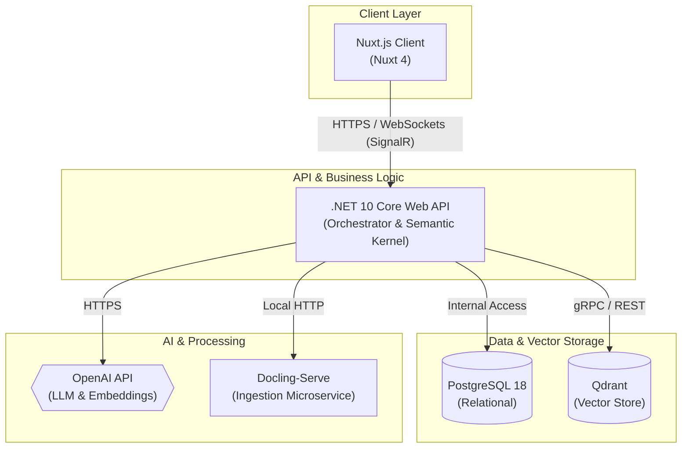
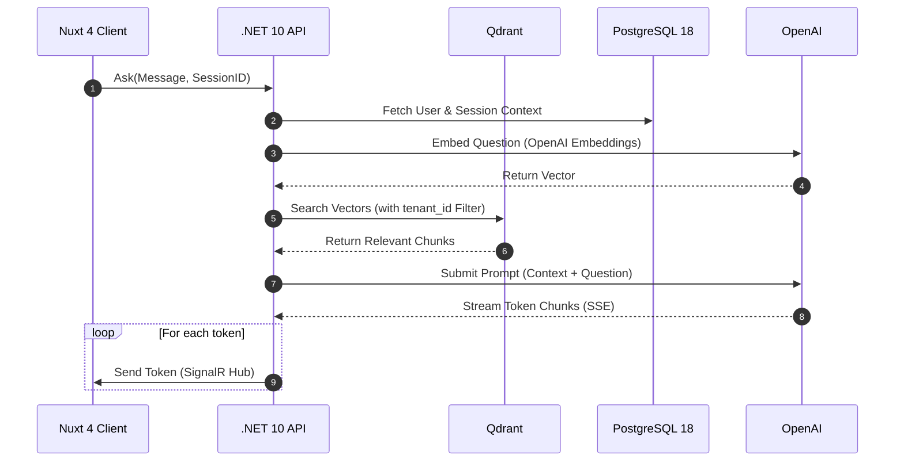

# Architectural Reference Document (ARD)
## Enterprise Multi-Tenant Customer Support Bot Architecture

### 1. System Topology Overview
This architecture is built on a decoupled, microservices-led structure. High performance, strict data isolation boundaries, and optimized hardware resource allocation are prioritized.



#### Component Architecture Definition

*   **Client Tier (Nuxt.js):**
    *   Client using **Nuxt 4**.
    *   Utilizes `@microsoft/signalr` client to negotiate real-time streaming connections.
    *   Manages local tenant themes, state hydration, and JWT token retention.
*   **Core API Gateway / Business Tier (.NET 10 Core Web API):**
    *   The compiled orchestrator using **.NET 10**.
    *   Houses business logic, role-based authorization, metadata-mapping, and tenant routing.
    *   Embeds **Microsoft Semantic Kernel (SK)** to unify vector database lookups, chat templating, and external API gateways.
*   **In-Memory/Vector Tier (Qdrant):**
    *   Stores 1536-dimension OpenAI embeddings.
    *   Leverages internal payload matching to execute deterministic tenant filtering alongside similarity math.
*   **Data Extraction Workers (Docling-Serve):**
    *   A CPU-optimized Python service running inside a local Podman container.
    *   Exposes REST endpoints to parse uploaded raw documents and emit semantic layout hierarchies as JSON payloads.
*   **Relational Storage Tier (PostgreSQL):**
    *   Stores tenant directory tables, customer account credentials, billing details, agent workspaces, configurations, and raw chat logs.
    *   Using **PostgreSQL 18**.

---

### 2. Multi-Tenancy Strategy (Logical Isolation Vault)
Strict data security demands multi-tier isolation. The system implements Logical Tenant Isolation across the entire stack.

#### 2.1 API Authentication Layer
Every request sent to the .NET Backend must carry a cryptographically signed Bearer JWT. The JWT payload must contain:
*   `tid` (Tenant ID - GUID)
*   `uid` (User ID - GUID)
*   `role` (Admin / Agent / Customer)

An ASP.NET Core middleware validation filter intercepts all requests, extracting the `tid` and storing it in a scoped execution context object (`TenantContext`).

#### 2.2 Relational Storage Isolation (PostgreSQL Row-Level Security)
To protect structural tables, PostgreSQL Row-Level Security (RLS) is enabled on all tables sharing multi-tenant metrics:

```sql
-- Enable Row-Level Security on Conversational Logs
ALTER TABLE chat_sessions ENABLE ROW LEVEL SECURITY;

-- Create Policy enforcing tenant_id match
CREATE POLICY tenant_isolation_policy ON chat_sessions
    FOR ALL
    USING (tenant_id = NULLIF(current_setting('app.current_tenant_id', true), '')::uuid);
```

Before executing any database query, the Entity Framework Core interceptor sets the transaction session variable `app.current_tenant_id` based on the scoped `TenantContext.TenantId`.

#### 2.3 Vector Database Isolation (Qdrant Payload Filtering)
Instead of spinning up individual server instances or collections for each tenant, we utilize Qdrant's highly optimized Payload Filtering.

Every document vector upserted to Qdrant contains a payload attribute: `tenant_id`. The C# Semantic Kernel connector or Qdrant Client applies a mandatory Payload Match Filter on every lookup.

```json
// Qdrant Search Request Structure
{
  "vector": [0.012, -0.045, 0.982, "..."],
  "limit": 5,
  "filter": {
    "must": [
      { "key": "tenant_id", "match": { "value": "a4d3b841-7290-4bf6-b5fa-cae80e1590fc" } }
    ]
  }
}
```

Because Qdrant indexes metadata keys using a payload index, Qdrant skips evaluating similarity distances for vectors belonging to other tenants. This guarantees zero cross-tenant leakage with no performance cost.

---

### 3. Core Pipelines & Sequences

#### 3.1 Document Ingestion Flow
This sequence maps how a Tenant Administrator uploads a PDF manual and populates both PostgreSQL and Qdrant.

```text
┌──────┐            ┌────────┐            ┌──────────┐            ┌───────────────┐            ┌────────┐
│ Nuxt │            │ C# API │            │ Postgres │            │ Docling-Serve │            │ Qdrant │
└──┬───┘            └───┬────┘            ────┬──────┘            ───────┬───────┘            ───┬────┘
   │                    │                     │                          │                       │
   │ 1. POST file       │                     │                          │                       │
   ├───────────────────>│                     │                          │                       │
   │                    │ 2. Save MetaRecord  │                          │                       │
   │                    ├────────────────────>│                          │                       │
   │                    │                     │                          │                       │
   │                    │ 3. Forward File     │                          │                       │
   │                    ├───────────────────────────────────────────────>│                       │
   │                    │                     │                          │                       │
   │                    │ 4. Return Structural Markdown / JSON Schema    │                       │
   │                    │<───────────────────────────────────────────────┤                       │
   │                    │                     │                          │                       │
   │                    │ 5. Save pre-parsed JSON                        │                       │
   │                    ├────────────────────>│                          │                       │
   │                    │                     │                          │                       │
   │                    │ 6. Parse chunks & call OpenAI Embeddings       │                       │
   │                    ├───────────────────────────────────────────────────────────────────────>│
   │                    │ 7. Upsert vectors with tenant_id payload                              │
   │                    ├───────────────────────────────────────────────────────────────────────>│
   │ 8. HTTP 200 (Done) │                     │                          │                       │
   │<───────────────────┤                     │                          │                       │
```

#### 3.2 Chat & Retrieval RAG Flow
This sequence details how a customer's question is parsed, matched, formulated into an isolated LLM prompt, and streamed back using SignalR.



---

### 4. Concrete Database Schema Blueprint

#### 4.1 PostgreSQL Schema (Relational Store)
Below is the SQL Schema definition required to handle tenants, configurations, session states, and document index trees.

```sql
CREATE EXTENSION IF NOT EXISTS "uuid-ossp";

-- 1. Tenant Table
CREATE TABLE tenants (
    id UUID PRIMARY KEY DEFAULT uuid_generate_v4(),
    name VARCHAR(255) NOT NULL,
    domain VARCHAR(100) UNIQUE NOT NULL,
    created_at TIMESTAMP WITH TIME ZONE DEFAULT CURRENT_TIMESTAMP,
    is_active BOOLEAN DEFAULT TRUE NOT NULL
);

-- 2. Tenant Configuration Profiles
CREATE TABLE tenant_configs (
    tenant_id UUID PRIMARY KEY REFERENCES tenants(id) ON DELETE CASCADE,
    bot_name VARCHAR(100) DEFAULT 'Support AI' NOT NULL,
    brand_primary_color VARCHAR(7) DEFAULT '#3B82F6' NOT NULL,
    custom_greeting VARCHAR(500) DEFAULT 'Hello! How can I assist you today?' NOT NULL,
    system_prompt_override TEXT NULL,
    updated_at TIMESTAMP WITH TIME ZONE DEFAULT CURRENT_TIMESTAMP
);

-- 3. Users (Administrators / Staff)
CREATE TABLE users (
    id UUID PRIMARY KEY DEFAULT uuid_generate_v4(),
    tenant_id UUID NOT NULL REFERENCES tenants(id) ON DELETE CASCADE,
    email VARCHAR(255) UNIQUE NOT NULL,
    password_hash VARCHAR(255) NOT NULL,
    role VARCHAR(50) DEFAULT 'Agent' NOT NULL, -- Admin, Agent
    first_name VARCHAR(100) NOT NULL,
    last_name VARCHAR(100) NOT NULL,
    created_at TIMESTAMP WITH TIME ZONE DEFAULT CURRENT_TIMESTAMP
);

-- 4. Document Source Metadata
CREATE TABLE document_sources (
    id UUID PRIMARY KEY DEFAULT uuid_generate_v4(),
    tenant_id UUID NOT NULL REFERENCES tenants(id) ON DELETE CASCADE,
    file_name VARCHAR(255) NOT NULL,
    file_path_storage VARCHAR(512) NOT NULL, -- Path inside Azurite/S3
    raw_file_size_bytes INT NOT NULL,
    chunk_count INT NOT NULL,
    status VARCHAR(50) DEFAULT 'Uploaded' NOT NULL, -- Uploaded, Processing, Indexed, Failed
    created_at TIMESTAMP WITH TIME ZONE DEFAULT CURRENT_TIMESTAMP
);

-- 5. Chat Sessions
CREATE TABLE chat_sessions (
    id UUID PRIMARY KEY DEFAULT uuid_generate_v4(),
    tenant_id UUID NOT NULL REFERENCES tenants(id) ON DELETE CASCADE,
    customer_email VARCHAR(255) NULL,
    customer_name VARCHAR(255) NULL,
    status VARCHAR(50) DEFAULT 'AI_Active' NOT NULL, -- AI_Active, Pending_Agent, Agent_Active, Closed
    created_at TIMESTAMP WITH TIME ZONE DEFAULT CURRENT_TIMESTAMP
);

-- 6. Individual Messages (Transaction Logs)
CREATE TABLE chat_messages (
    id UUID PRIMARY KEY DEFAULT uuid_generate_v4(),
    session_id UUID NOT NULL REFERENCES chat_sessions(id) ON DELETE CASCADE,
    tenant_id UUID NOT NULL REFERENCES tenants(id) ON DELETE CASCADE,
    sender_type VARCHAR(50) NOT NULL, -- System, AI, Agent, Customer
    content TEXT NOT NULL,
    citations_json JSONB NULL, -- Back-references to source document fragments
    created_at TIMESTAMP WITH TIME ZONE DEFAULT CURRENT_TIMESTAMP
);

-- Indices for rapid routing and tenant boundary checks
CREATE INDEX idx_users_tenant ON users(tenant_id);
CREATE INDEX idx_docs_tenant ON document_sources(tenant_id);
CREATE INDEX idx_sessions_tenant ON chat_sessions(tenant_id);
CREATE INDEX idx_messages_session ON chat_messages(session_id);
```

#### 4.2 Qdrant Payload Structure
The following payload properties are appended to every single vector point stored within Qdrant:

```json
{
  "id": "e8df457c-86da-4cbf-bf61-39fe5382377c",
  "vector": [0.0019, -0.0122, 0.0815, "..."],
  "payload": {
    "tenant_id": "a4d3b841-7290-4bf6-b5fa-cae80e1590fc",
    "document_id": "97e6820c-c60f-488b-a320-f59798782a21",
    "text_content": "To configure your account notifications, navigate to settings panel and select preferences tab.",
    "parent_header": "User Profile Management -> Notifications",
    "file_name": "user_guide.pdf",
    "page_number": 14,
    "chunk_index": 45
  }
}
```

---

### 5. Development Infrastructure Setup (Local Podman Configuration)
Below is your local development topology. Using Podman, you can spin up the entire isolated stack natively inside your NixOS-WSL terminal.

```yaml
# filepath: compose.yaml
version: '3.8'

services:
  # Transactional Database
  postgres:
    image: docker.io/library/postgres:18-alpine
    container_name: postgres-local
    environment:
      POSTGRES_USER: root
      POSTGRES_PASSWORD: supersecretpassword
      POSTGRES_DB: support_platform
    ports:
      - "5432:5432"
    volumes:
      - postgres_data:/var/lib/postgresql/data
    deploy:
      resources:
        limits:
          memory: 1g

  # High-Performance Vector Store
  qdrant:
    image: docker.io/qdrant/qdrant:latest
    container_name: qdrant-local
    ports:
      - "6333:6333" # REST interface & Dashboard
      - "6334:6334" # gRPC interface
    volumes:
      - qdrant_data:/qdrant/storage
    deploy:
      resources:
        limits:
          memory: 1.5g

  # Document Layout Analyzer AI Engine
  docling-serve:
    image: quay.io/docling-project/docling-serve:latest
    container_name: docling-serve-local
    environment:
      - DOCLING_SERVE_ENABLE_UI=false
      - OMP_NUM_THREADS=2           # Keeps background math limited to 2 CPU threads
      - UVICORN_WORKERS=1           # Ensures linear parsing queue to prevent RAM lock
    ports:
      - "5001:5001"
    deploy:
      resources:
        limits:
          memory: 3.5g              # Minimum threshold to safely hold visual models in RAM

volumes:
  postgres_data:
  qdrant_data:
```

This ensures that your development workstation runs cleanly, keeping the total stack memory footprint around ~6.5GB, and leaving plenty of room for Nuxt.js, Visual Studio, and standard web operations on your 16GB device.
.
