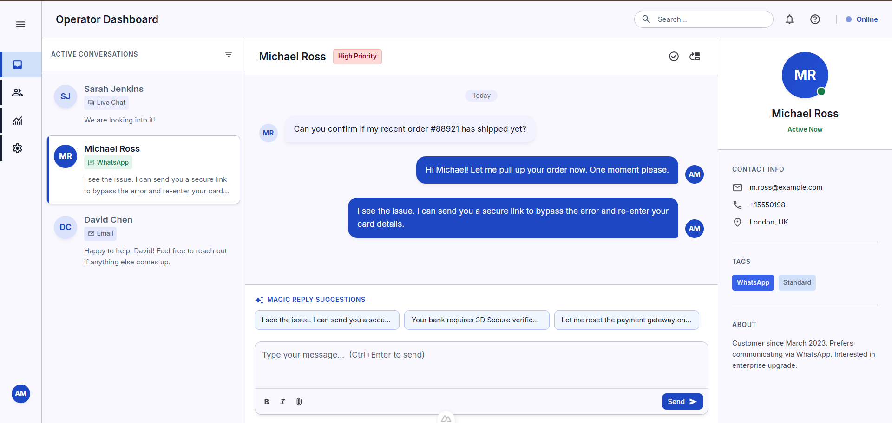

# Omnichannel Customer Support Operator Platform



A high-performance customer support platform built with a decoupled .NET 10 API backend and a Nuxt 4 client.

## 🛠️ Tech Stack Overview

- **Backend:** .NET 10 (C# 14), Microsoft.Extensions.AI, EF Core 10, Coravel, HybridCache, Scalar OpenAPI.
- **Frontend:** Nuxt 4, Vue 3, TailwindCSS, Nuxt UI, Pinia & Pinia Colada.
- **Infrastructure:** PostgreSQL 18, Qdrant Vector DB, Azurite (Azure Storage emulator), Docling-Serve (Document parser), Garnet (Cache/Store), Seq (Structured logging).

---

## ⚙️ Quick Start

This project uses **Nix Flakes** and **direnv** to manage a fully reproducible development shell with all required CLI tools.

### 1. Prerequisites

- [Nix Package Manager](https://nixos.org/download) with Flakes enabled.
- [direnv](https://direnv.net/) (optional but recommended to auto-load the environment).
- Docker (or Podman) for managing local services.

### 2. Environment Variables & Secret Management

**Important:** This project explicitly avoids using `appsettings.json`. **All** configuration and secret management are entirely centralized in environment variables to strictly adhere to the 12-Factor App methodology.

This project supports secret delivery via **Infisical** (primary) and `.env.local` file (fallback/local overrides).

#### Option A: Infisical (Primary)

Ensure you have the Infisical CLI installed. First, authenticate the CLI by running:

```bash
infisical login
```

Once authenticated, secrets will be automatically exported when entering the directory via `direnv` (if configured), or you can manually export them using:

```bash
eval $(infisical export --format=dotenv-export --silent)
```

#### Option B: Local File Configuration (Fallback)

Initialize the `.env.local` file (which is gitignored) using the unified `just` command:

```bash
just init-env
```

This script will verify your Infisical login status before creating the file. Then configure your local secrets inside `.env.local`. **Note:** Values in `.env.local` will override those fetched from Infisical.

### 3. Enter Development Shell

If you have `direnv` configured, entering the project directory will automatically load the environment:

```bash
direnv allow
```

Alternatively, enter the shell manually:

```bash
nix develop
```

### 4. Restore Dependencies & Install Git Hooks

Once inside the development shell, simply run the setup command:

```bash
just setup
```

This will initialize the environment, install both backend and frontend dependencies, start infrastructure services, and apply database migrations.

---

### 5. Start Infrastructure & Apply Database Migrations (Manual)

If you prefer manual control over the setup process:

1. **Spin up local infrastructure services:**

   ```bash
   just infra-up
   ```

2. **Generate initial migrations for all modules:**

   ```bash
   just server-migrations-add InitialCreate
   ```

3. **Apply migrations:**
   ```bash
   just server-migrate
   ```

### 6. Run the Platform

We use [Just](https://github.com/casey/just) to orchestrate the development environment.

#### Initial Setup

If this is your first time setting up the project:

```bash
just setup
```

#### Daily Development

To start everything (infrastructure + backend + frontend) in parallel:

```bash
just run
```

Alternatively, you can start them separately:

```bash
# Start infrastructure only
just infra-up

# Start backend API (watch mode)
just server-run

# Start frontend client (dev mode)
just client-run
```

The services will be available at:

- **Client Workspace (Nuxt 4):** [http://localhost:3000](http://localhost:3000)
- **API Swagger / Scalar:** [http://localhost:5136/scalar/openapi](http://localhost:5136/scalar/openapi)
- **Seq Log Viewer:** [http://localhost:8081](http://localhost:8081)

To shut down infrastructure services:

```bash
just infra-down
```

---

## 🔧 Essential Development Commands

### Running Tests

Always run the test suite before committing or pushing:

To run backend (.NET) tests:

```bash
just server-test
```

To run frontend (Nuxt) tests:

```bash
just client-test
```

Alternatively, run the complete verification suite (build, lint, formatting, and tests):

```bash
just ci
```

### Code Formatting

This project uses `just format` to enforce unified formatting rules (dotnet format, ESLint, and Alejandra):

```bash
just format
```

---

## 📝 Project Architecture & Documentation

- [CONTEXT.md](file:///home/ukasha/code/chatbot/main/CONTEXT.md): Directory topology, port mapping, and tech stack details.
- [AGENTS.md](file:///home/ukasha/code/chatbot/main/AGENTS.md): Strict rules and instructions for AI agents.
- [docs/PRD.md](file:///home/ukasha/code/chatbot/main/docs/PRD.md): Product requirement documentation.
- [docs/ARD.md](file:///home/ukasha/code/chatbot/main/docs/ARD.md): Database schema blueprints and system topologies.
- [docs/PLAN.md](file:///home/ukasha/code/chatbot/main/docs/PLAN.md): Modular milestone implementation schedule.
- [docs/GIT_WORKFLOW.md](file:///home/ukasha/code/chatbot/main/docs/GIT_WORKFLOW.md): Branching, PRs, and commit guidelines.
- [docs/adr/](file:///home/ukasha/code/chatbot/main/docs/adr/): Architecture Decision Records (ADRs).
