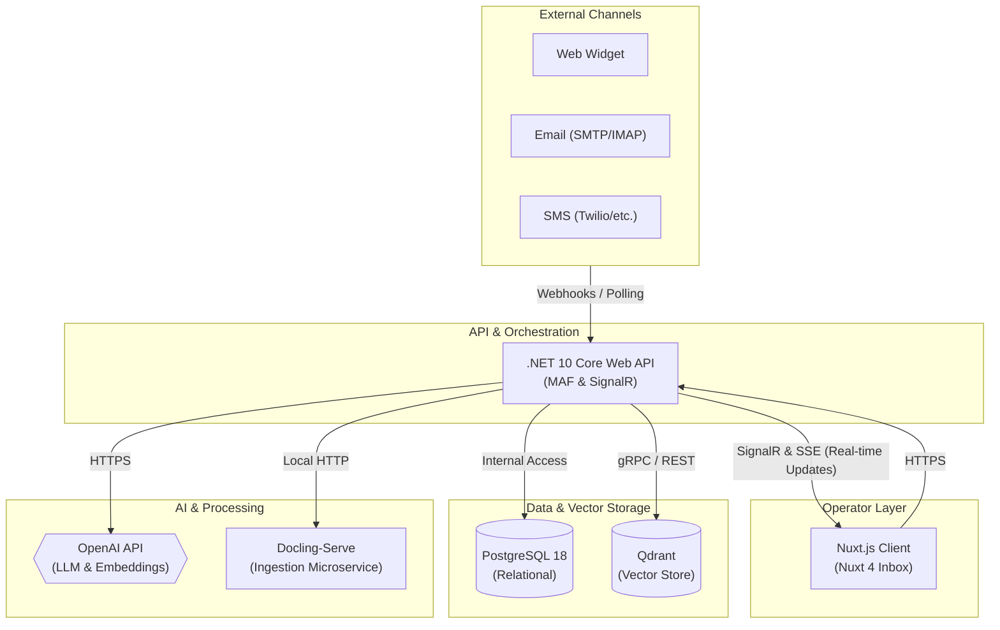
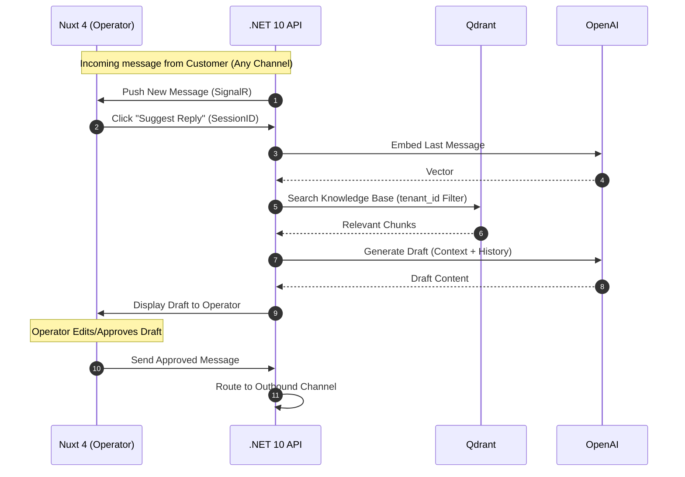

# Architectural Reference Document (ARD)

## Omnichannel Customer Support Operator Platform Architecture

### 1. System Topology Overview

This architecture is built on a decoupled, microservices-led structure. High performance, strict data isolation boundaries, and optimized hardware resource allocation are prioritized.



#### Component Architecture Definition

- **Operator Dashboard (Nuxt.js):**
  - Built with **Nuxt 4**.
  - Implements a unified inbox for multi-channel message management.
  - Uses `@microsoft/signalr` for real-time inbox state synchronization.
- **Core API Gateway (.NET 10 Core Web API):**
  - The central orchestrator using **.NET 10**.
  - Manages tenant routing, channel webhooks, and operator authorization.
  - Employs **Microsoft Agent Framework (MAF)** for on-demand RAG suggestions.
- **In-Memory/Vector Tier (Qdrant via Microsoft.Extensions.VectorData):**
  - Stores 1536-dimension OpenAI embeddings with mandatory `tenant_id` payload filtering.
  - Accessed via the `Microsoft.Extensions.VectorData` abstraction layer (`VectorStore` / `VectorStoreCollection<TKey, TRecord>`), backed by the `Microsoft.SemanticKernel.Connectors.Qdrant` provider.
  - The abstraction decouples business logic from the concrete vector database, making the backend swappable (e.g., to pgvector or Azure AI Search) via a DI registration change.
- **Data Extraction Workers (Docling-Serve):**
  - Parses uploaded raw documents and emits semantic layout hierarchies for knowledge base grounding.
- **Relational Storage Tier (PostgreSQL):**
  - Stores tenant configurations, operator accounts, omnichannel session states, and message logs.

---

### 2. Multi-Tenancy Strategy (Logical Isolation Vault)

#### 2.1 API Authentication Layer

Every request carries a Bearer JWT containing `tid` (Tenant ID). A middleware extracts this into a scoped `TenantContext`.

#### 2.2 Relational Storage Isolation (PostgreSQL RLS)

PostgreSQL Row-Level Security (RLS) is used to isolate tenant data. The `app.current_tenant_id` session variable is set per transaction. Complex metadata and citations are managed via **EF Core 10 Native JSON Mapping** into `jsonb` columns.

#### 2.3 Vector Database Isolation (Qdrant Payload Filtering)

A mandatory `tenant_id` Payload Match Filter is applied to every search, ensuring zero cross-tenant leakage.

---

### 3. Core Pipelines & Sequences

#### 3.1 Document Ingestion Flow (Knowledge Base)

1. Admin uploads document via Nuxt 4.
2. .NET API sends file to **Docling-Serve**.
3. Docling returns structural markdown/JSON.
4. .NET API chunks the content and generates embeddings via OpenAI.
5. Vectors are upserted to Qdrant with `tenant_id`.

#### 3.2 AI-Assisted Reply Flow (Human-in-the-Loop)



---

### 4. Concrete Database Schema Blueprint

#### 4.1 PostgreSQL Schema (Relational Store)

```sql
CREATE EXTENSION IF NOT EXISTS "uuid-ossp";

-- 1. Tenant & Config (Same as before)
CREATE TABLE tenants (
    id UUID PRIMARY KEY DEFAULT uuid_generate_v4(),
    name VARCHAR(255) NOT NULL,
    domain VARCHAR(100) UNIQUE NOT NULL,
    created_at TIMESTAMP WITH TIME ZONE DEFAULT CURRENT_TIMESTAMP,
    is_active BOOLEAN DEFAULT TRUE NOT NULL
);

-- 2. Users (Operators)
CREATE TABLE users (
    id UUID PRIMARY KEY DEFAULT uuid_generate_v4(),
    tenant_id UUID NOT NULL REFERENCES tenants(id) ON DELETE CASCADE,
    email VARCHAR(255) UNIQUE NOT NULL,
    role VARCHAR(50) DEFAULT 'Agent' NOT NULL, -- Admin, Agent
    first_name VARCHAR(100) NOT NULL,
    last_name VARCHAR(100) NOT NULL,
    created_at TIMESTAMP WITH TIME ZONE DEFAULT CURRENT_TIMESTAMP
);

-- 3. Omnichannel Chat Sessions
CREATE TABLE chat_sessions (
    id UUID PRIMARY KEY DEFAULT uuid_generate_v4(),
    tenant_id UUID NOT NULL REFERENCES tenants(id) ON DELETE CASCADE,
    channel_provider VARCHAR(50) NOT NULL, -- 'WebWidget', 'Email', 'Twilio'
    external_reference_id VARCHAR(255) NULL, -- Email Message-ID, Twilio SID
    customer_identifier VARCHAR(255) NOT NULL, -- Email address, Phone number, or Session UUID
    status VARCHAR(50) DEFAULT 'Open' NOT NULL, -- Open, Pending, Resolved
    assigned_to UUID NULL REFERENCES users(id),
    created_at TIMESTAMP WITH TIME ZONE DEFAULT CURRENT_TIMESTAMP
);

-- 4. Individual Messages
CREATE TABLE chat_messages (
    id UUID PRIMARY KEY DEFAULT uuid_generate_v4(),
    session_id UUID NOT NULL REFERENCES chat_sessions(id) ON DELETE CASCADE,
    tenant_id UUID NOT NULL REFERENCES tenants(id) ON DELETE CASCADE,
    sender_type VARCHAR(50) NOT NULL, -- Customer, Agent, System
    content TEXT NOT NULL,
    status VARCHAR(50) DEFAULT 'Sent' NOT NULL, -- Sent, Delivered, Failed, Draft
    is_ai_generated BOOLEAN DEFAULT FALSE NOT NULL,
    approved_by UUID NULL REFERENCES users(id),
    citations_json JSONB NULL,
    created_at TIMESTAMP WITH TIME ZONE DEFAULT CURRENT_TIMESTAMP
);

-- 5. Knowledge Base Sources
CREATE TABLE document_sources (
    id UUID PRIMARY KEY DEFAULT uuid_generate_v4(),
    tenant_id UUID NOT NULL REFERENCES tenants(id) ON DELETE CASCADE,
    file_name VARCHAR(255) NOT NULL,
    status VARCHAR(50) DEFAULT 'Indexed' NOT NULL,
    created_at TIMESTAMP WITH TIME ZONE DEFAULT CURRENT_TIMESTAMP
);

CREATE INDEX idx_sessions_channel ON chat_sessions(channel_provider, external_reference_id);
CREATE INDEX idx_messages_session ON chat_messages(session_id);
```

---

### 5. Development Infrastructure Setup

(Standard Docker configuration for Postgres, Qdrant, and Docling remains applicable as per the unified topology).

---

### 6. Architectural Decisions

#### ADR-001: Adopt Microsoft.Extensions.VectorData Abstractions for Vector Store Access

**Date:** 2026-06-09
**Status:** Accepted

**Context:**
The original `VectorBroker` used the raw `Qdrant.Client` gRPC SDK directly, manually constructing `PointStruct` objects and mapping values to/from Qdrant's protobuf `Value` type. This approach was tightly coupled to Qdrant internals, making it difficult to test without a live Qdrant instance and impossible to swap backends without a full rewrite.

**Decision:**
Adopt `Microsoft.Extensions.VectorData.Abstractions` (`v10.6.0`) as the unified vector store abstraction, backed by `Microsoft.SemanticKernel.Connectors.Qdrant` (`v1.74.0-preview`).

- A new `VectorRecord` model is declared with `[VectorStoreKey]`, `[VectorStoreData]`, and `[VectorStoreVector(1536)]` attributes for declarative schema mapping.
- `VectorBroker` injects `VectorStore` (registered as `QdrantVectorStore`) and calls `GetCollection<ulong, VectorRecord>()`, `EnsureCollectionExistsAsync()`, `UpsertAsync()`, and `SearchAsync()`.
- The `IVectorBroker` interface boundary is **unchanged** — all services consuming vectors require zero code changes.
- `QdrantClient` and `VectorStore` are registered via the `AddQdrantVectorStore(IServiceCollection, ...)` DI extension, using the lazy factory pattern for Options-based configuration.

**Consequences:**

- Provider is swappable via a single DI registration change.
- Unit tests can use `InMemory` vector store provider without Docker.
- Manual gRPC payload mapping helpers are eliminated.
- IL2026/IL3050 AOT warnings are suppressed with justification (project is AOT-ready by design, not compiled with `PublishAot=true`).
