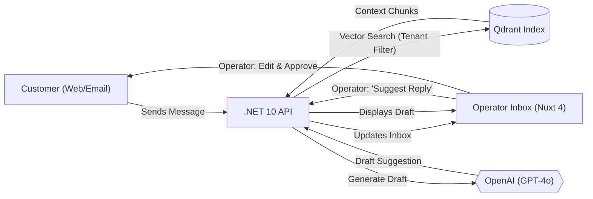
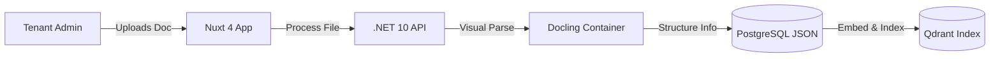

# Product Requirement Document (PRD)

## Omnichannel Customer Support Operator Platform

### 1. Executive Summary

This document defines the requirements for an enterprise-grade, omnichannel customer support operator platform. The product enables diverse business entities (tenants) to manage customer communications across multiple channels (Web, Email, SMS) within a unified inbox. It features a knowledge-base-driven AI assistant that provides draft replies for human operators to review, edit, and approve before sending.

Security and architectural isolation are paramount: under no circumstances may one tenant's queries, documents, or conversation logs leak to another tenant. The target architecture supports high concurrency with low latency using a lightweight, scalable tech stack.

---

### 2. Key Objectives & Success Metrics

#### 2.1 Strategic Goals

- **Unified Omnichannel Management:** Centralize customer interactions from disparate channels into a single, efficient operator interface.
- **Human-in-the-Loop AI Efficiency:** Utilize RAG-driven AI to reduce operator response time through high-quality draft suggestions.
- **Zero-Leakage Multi-Tenancy:** Ensure strict logical boundary isolation for data storage and query processing across tenant spaces.
- **Snappy Operator Experience:** Real-time inbox updates and instantaneous AI suggestion generation using **Nuxt 4**.

#### 2.2 Success Metrics (KPIs)

- **Operator Productivity:** >40% reduction in Average Response Time (ART) using AI suggestions.
- **AI Suggestion Quality:** >80% of AI-generated drafts approved by operators with minimal editing.
- **Zero Data-Leakage Events:** 100% tenant isolation verified by security penetration tests.
- **Latency Targets:**
  - Time-to-AI-Suggestion: < 1.2 seconds.
  - Real-time message delivery (SignalR): < 200 ms.

---

### 3. User Personas

| Persona                      | Role                     | Primary Goals                                                                                            | Core Pain Points                                                   |
| :--------------------------- | :----------------------- | :------------------------------------------------------------------------------------------------------- | :----------------------------------------------------------------- |
| **System Administrator**     | Global Platform Owner    | Manage platform billing, tenant onboarding, globally set API limits, and monitor system performance.     | Tracking resource usage; maintaining high system availability.     |
| **Tenant Administrator**     | Business/Support Manager | Onboard support staff, upload knowledge base files, configure branding, and set up channel integrations. | Disjointed communication channels; inconsistent brand voice.       |
| **Support Agent / Operator** | Primary User             | Manage the unified inbox, use AI suggestions to reply faster, and maintain high customer satisfaction.   | High ticket volume; repetitive questions; switching between tools. |
| **Customer/End-User**        | Customer seeking help    | Receive timely and accurate support through their preferred channel (Web, Email, etc.).                  | Long wait times; fragmented support experiences.                   |

---

### 4. Functional Requirements

#### 4.1 Unified Omnichannel Inbox

- Aggregation of messages from multiple channels (Web Widget, Email, API-based integrations).
- Real-time message status tracking (New, Open, Pending, Resolved).
- Operator assignment and internal conversation notes.

#### 4.2 AI-Assisted Reply Drafting (Knowledge Base RAG)

- On-demand "Suggest Reply" feature within the operator chat interface.
- AI drafting based on proprietary tenant documentation (PDF, DOCX, TXT).
- Visual-aware parsing (Docling) to ensure AI understands complex document structures.
- Operator review, editing, and explicit approval before any AI-generated content is sent to the customer.

#### 4.3 Knowledge Base Management

- Tenant-scoped document library (CRUD).
- Automatic chunking and embedding generation via OpenAI for RAG operations.
- Citations in AI drafts linking back to specific document fragments for operator verification.

#### 4.4 Multi-Tenant Security

- JWT-based authentication with mandatory Tenant ID (`tid`) claims.
- Database Row-Level Security (RLS) for all relational data.
- Payload-filtered vector searches in Qdrant.

---

### 5. Flow Diagrams

#### 5.1 Omnichannel Ingestion & RAG Flow

#### 5.2 Document Ingestion Flow

---

### 6. Technical Requirements

- **Frontend:** Nuxt 4 (TypeScript, Tailwind CSS).
- **Backend:** .NET 10 Web API (C#, Semantic Kernel).
- **Database:** PostgreSQL 18 (Relational), Qdrant (Vector).
- **AI Services:** OpenAI (GPT-4o, Text-Embedding-3-Small).
- **Infrastructure:** Docker Compose for local development; Docling-Serve for PDF ingestion.
