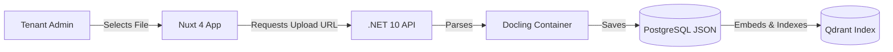
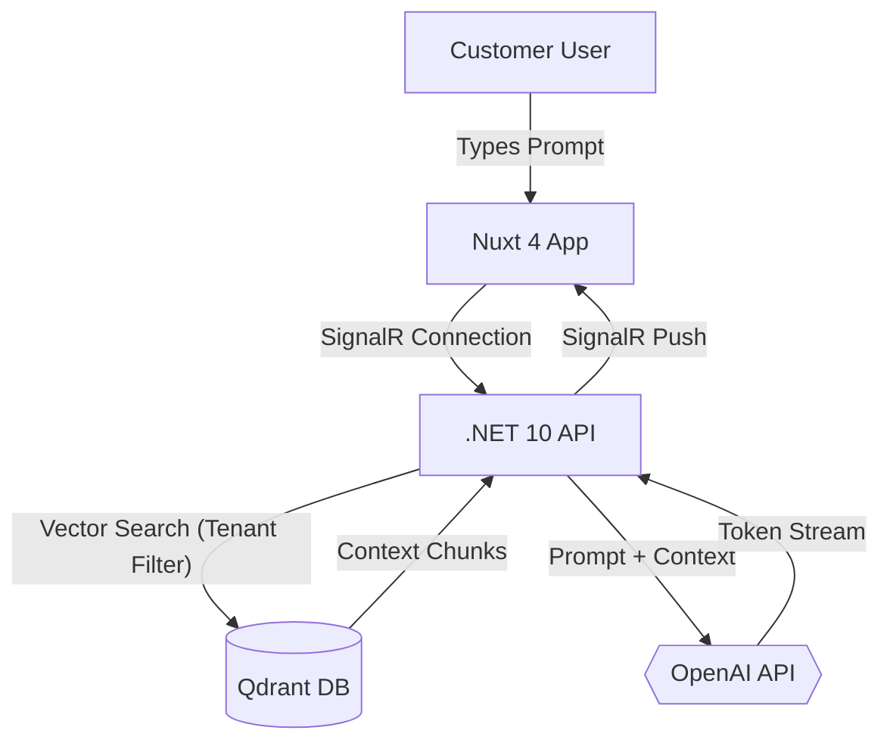

# Product Requirement Document (PRD)

## Multi-Tenant Customer Support AI Chatbot

### 1. Executive Summary

This document defines the requirements for a multi-tenant, enterprise-grade AI Customer Support Chatbot. The product enables diverse business entities (tenants) to upload proprietary operational documents (such as manuals, policies, and FAQs), parse them using visual structure-aware ingestion tools, and deliver a fast, localized Retrieval-Augmented Generation (RAG) chat agent.

Security and architectural isolation are paramount: under no circumstances may one tenant's queries, documents, or conversation logs leak to another tenant. The target architecture supports high concurrency with low latency using a lightweight, scalable tech stack.

---

### 2. Key Objectives & Success Metrics

#### 2.1 Strategic Goals

- **Zero-Leakage Multi-Tenancy:** Ensure strict logical boundary isolation for data storage and query processing across tenant spaces.
- **Structural Ingestion Accuracy:** Maintain document tables, bullet structures, and layout flows for accurate customer answers.
- **Snappy User Experience:** Real-time typewriter streaming for AI answers, combined with instantaneous document state transitions on the client interface using **Nuxt 4**.

#### 2.2 Success Metrics (KPIs)

- **Zero Data-Leakage Events:** 100% tenant isolation verified by security penetration tests.
- **Answer Retrieval Accuracy (Hallucination Control):** >95% of support responses verified to rely strictly on tenant-provided documentation.
- **Latency Targets:**
  - Time-to-First-Token (TTFT) for chat answers: < 800 ms.
  - Document conversion turnaround time (Docling parsing): < 2.5 seconds per page.

---

### 3. User Personas

| Persona                  | Role                     | Primary Goals                                                                                                | Core Pain Points                                               |
| :----------------------- | :----------------------- | :----------------------------------------------------------------------------------------------------------- | :------------------------------------------------------------- |
| **System Administrator** | Global Platform Owner    | Manage platform billing, tenant onboarding, globally set API limits, and monitor system performance.         | Tracking resource usage; maintaining high system availability. |
| **Tenant Administrator** | Business/Support Manager | Onboard support staff, upload knowledge base files (PDF, Word, TXT), configure bot branding and personality. | Ensuring AI answers are accurate and reflect brand voice.      |
| **Support Agent**        | Human Operator           | Monitor active AI chats, intervene when AI fails, and manage document library updates.                       | High ticket volume; repetitive questions.                      |
| **Customer/End-User**    | Customer seeking help    | Get instant, accurate answers to specific product questions without waiting for a human.                     | Long hold times; irrelevant search results.                    |

---

### 4. Functional Requirements

#### 4.1 Document Ingestion & Management

- Support for PDF, DOCX, and TXT file uploads.
- Visual-aware parsing (Docling) to preserve table structures and hierarchies.
- Automatic chunking and embedding generation via OpenAI.
- Tenant-scoped document library management (CRUD).

#### 4.2 AI Chat Interface

- Real-time streaming responses (SignalR).
- Source citations for every AI claim (linking back to original document fragments).
- Typewriter effect and interactive feedback (thumbs up/down).
- Branding customization (colors, bot name, greeting message).

#### 4.3 Multi-Tenant Security

- JWT-based authentication with mandatory Tenant ID (`tid`) claims.
- Database Row-Level Security (RLS) for all relational data.
- Payload-filtered vector searches in Qdrant.

---

### 5. Flow Diagrams

#### 5.1 Ingestion Flow

#### 5.2 Chat Retrieval & Streaming Flow

---

### 6. Technical Requirements

- **Frontend:** Nuxt 4 (TypeScript, Tailwind CSS).
- **Backend:** .NET 10 Web API (C#, Semantic Kernel).
- **Database:** PostgreSQL 18 (Relational), Qdrant (Vector).
- **AI Services:** OpenAI (GPT-4o, Text-Embedding-3-Small).
- **Infrastructure:** Docker Compose for local development.
